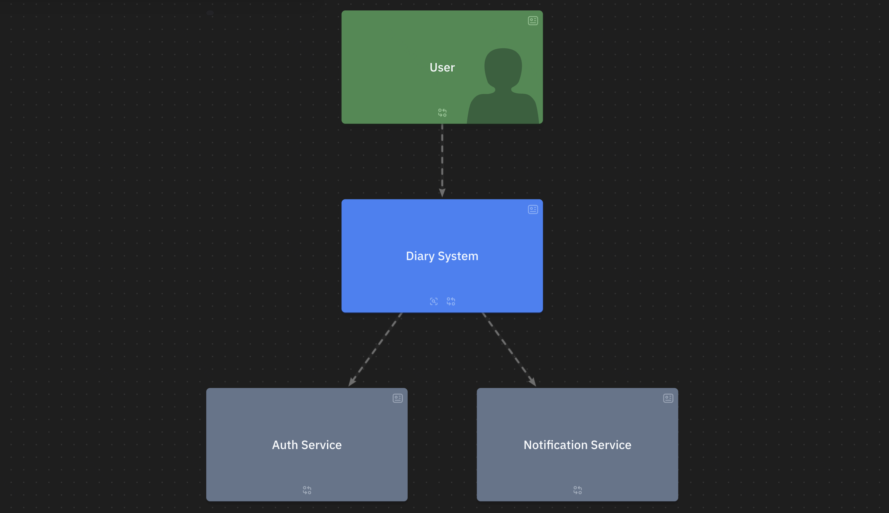
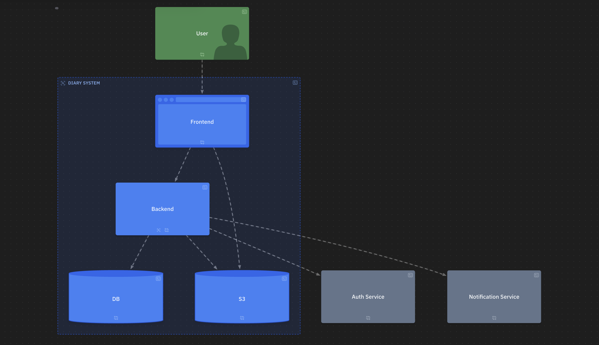
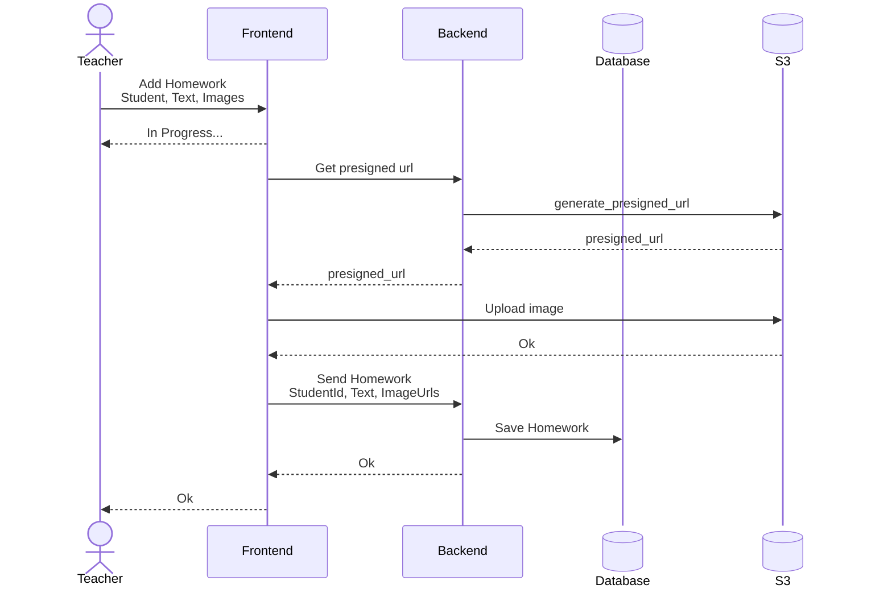
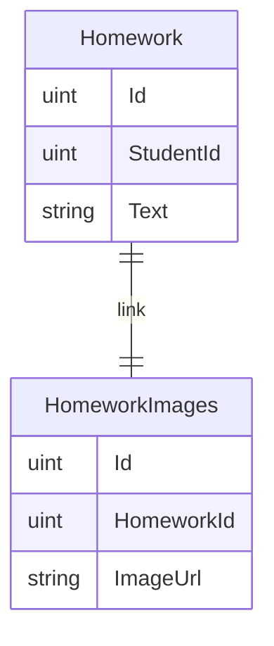
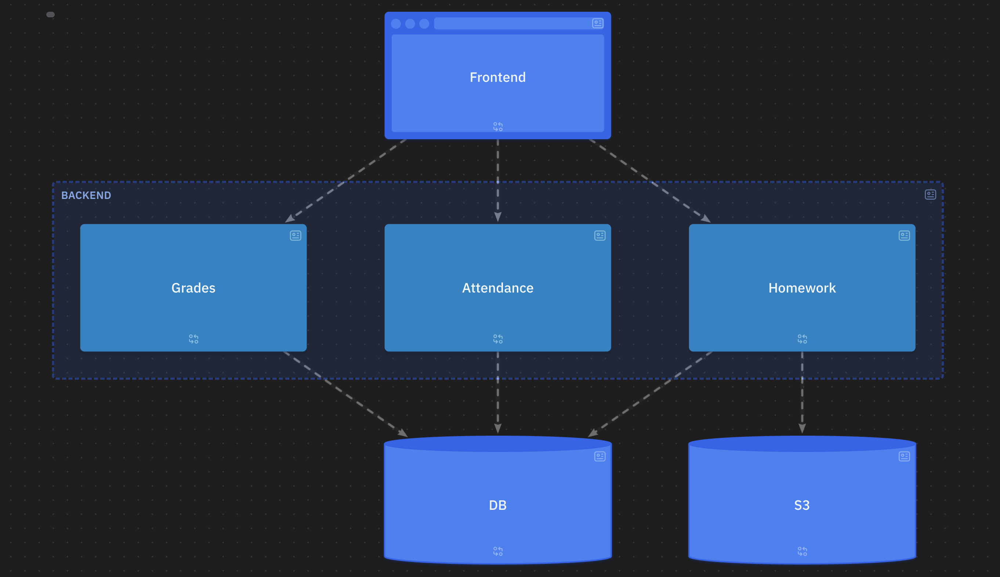

# System design

Онлайн-дневник школьника
- Оценки
- Домашние задания
- Посещения

## 1. Требования

- Функциональные требования
	- Учитель может поставить оценку ученику по своему предмету
	- Учитель может изменить поставленную оценку
	- Ученик может видеть свои оценки по всем предметам
	- Ученик может видеть свои оценки за четверть по всем предметам (среднее арифметическое всех оценок по предмету за четверть)
	- Ученик может получить уведомление, когда ему поставлена оценка
	- Учитель может задать ДЗ по своему предмету ученикам (текст + картинки)
	- Ученик может видеть свое ДЗ по всем предметам
	- ...
	- *Родитель может видеть оценки своих детей по всем предметам*
	- *Родитель может видеть ДЗ, заданное своим детям по всем предметам*
- Нефункциональные требования
	- MVP
		- DAU: 30 учеников, 1 учитель
		- RPS
			- Write: После урока учитель ставит оценки всем ученикам
				- 1 RPS
			- Read: Каждый ученик 5 раз в день (8 часов) смотрит свои оценки
				- (30 x 5) / 8 / 60 / 60 => менее 1 RPS
		- SLA: 90% (Возможный downtime 36 дней в год)
	- Целевой продукт
		- DAU: 5000 учеников, 100 учителей, 7000 родителей
		- RPS
			- Write: После урока учитель ставит оценки всем ученикам, одновременно проходит 50 уроков
				- 50 RPS
			- Read: Каждый ученик 5 раз в день (8 часов) смотрит свои оценки, каждый родитель 2 раза в день смотрит оценки
				- (5000 x 5 + 1500 x 2) / 8 / 60 / 60 => менее 1 RPS
		- SLA: 99,99% (Возможный downtime 52 минуты в год)

## 2. Границы системы

- Внешние системы
	- Сервис авторизации/аутентификации
	- Сервис уведомлений



## 3. Компоненты системы и потоки данных



### Масштабирование

- Для реализации требований целевого проекта необходимо
	- ...

### Схемы бизнес-процессов

#### Учитель задает ДЗ

- Для уменьшения количества перезаписывания файлов с картинками Frontend загружает картинки напрямую в S3
- Необходимо реализовать SSE или WS для уведомления пользователя об окончании загрузки ДЗ



## 4. API, модель данных

### API
```
GET: /api/presigned-url
```
```
POST: /api/homework
{
	StudentId
	Text
	ImageUrl[]
}
```

### Database



## 5. Выбор конкретных технологий

- Языки и стеки для Frontend
- Языки и стеки для Backend
- Реализации БД

## 6. Компоненты

### Backend

